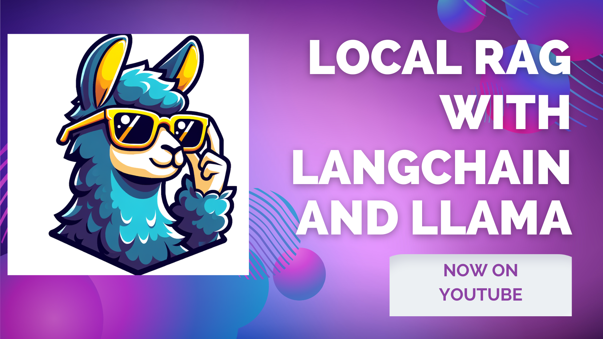

# Local RAG with LangChain, LLaMa and Hugging Face

Welcome to the repo of the tutorial "Local RAG with LangChain, LLaMa and Hugging Face". This repo contains code and helper data of the [Youtube video tutorial](https://www.youtube.com/watch?v=2QLIAT8zwps&list=PLJTHlIwB8VcpfpENOx86IHzLYyeG1nm9H&index=4), second video of the series ["Practical RAG with LangChain under 15 Minutes"](https://www.youtube.com/playlist?list=PLJTHlIwB8VcpfpENOx86IHzLYyeG1nm9H).

In this part of the series, we implement local RAG code with a LLaMa model and a sentence transformer as the embedding model. We use langchain-huggingface library code for employing both the embeddings model and the LLM, all computations are made on GPU.

The code is on Google Colab for GPU availability. If you wanna work on the Colab notebook directly, please navigate to:
https://colab.research.google.com/drive/1b2cZZ41l7ySkdAMjraUZ80mcyhYCmUhj?usp=sharing

and make your own copy of the notebook. You can also find the notebook in the repo.
The requirements are installed in the first few lines of the notebook.

You can access [first video](https://www.youtube.com/watch?v=46kWu6mC63s&list=PLJTHlIwB8VcpfpENOx86IHzLYyeG1nm9H&index=3) and [third video](https://www.youtube.com/watch?v=zc0CxVV-4-g&list=PLJTHlIwB8VcpfpENOx86IHzLYyeG1nm9H&index=5) of the series on Youtube as well, their Github repos are linked in the videos.

If you would like more content, don't forget to visit finetuning LLM series of mine, [Practical LLM Finetuning Recipes](https://github.com/DuyguA/YT-Practical-LLM-Recipes).

Thanks for your visit and happy coding!

